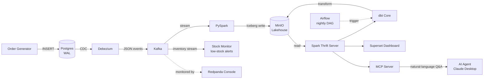
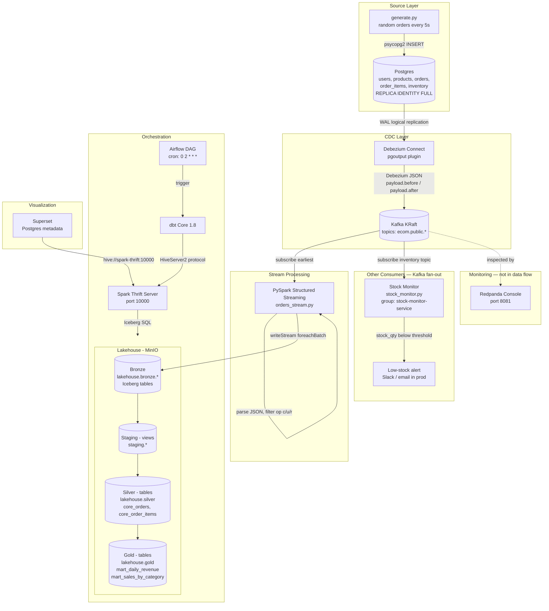

# E-Commerce Real-Time Pipeline

A real-time e-commerce data pipeline built with open-source tools on a self-hosted lakehouse. Designed as a portfolio project targeting Turkish e-commerce companies (Trendyol, n11, Hepsiburada).

## What This Project Solves

Modern e-commerce companies need to answer questions like *"How much revenue did we make today?"*, *"Which products are trending right now?"*, or *"How many orders got cancelled in the last hour?"* — and they need answers fast, without slowing down the production database.

This pipeline shows how to do that end-to-end:

- **Capture every change** in the operational database (Postgres) the moment it happens, without polling tables or impacting performance — using **CDC** via Debezium.
- **Decouple producers from consumers** with Kafka, so you can add new downstream systems (analytics, ML, search) without touching the source database.
- **Store raw data cheaply but reliably** in a self-hosted lakehouse (MinIO + Iceberg) — same benefits as Snowflake or Databricks, no cloud vendor lock-in.
- **Transform data in layers** (bronze → silver → gold) with dbt, so analysts get clean, business-ready tables and engineers keep raw data available for reprocessing.
- **Run transformations on a schedule** with Airflow, so the analytics tables are always fresh by morning.
- **Visualize results** with Superset, so business users see charts instead of SQL.
- **Query the warehouse in plain language** through an **MCP server**, so an AI agent (e.g. Claude Desktop) can answer questions like *"who are my top 5 customers by spend?"* — discovering the schema and writing the SQL itself, read-only.

In short: it shows how to build the **same data infrastructure that companies like Trendyol, Hepsiburada or n11 run in production** — but with open-source tools and a single `docker compose up`.

## High-Level Architecture



## Low-Level Data Flow



## Component Breakdown

### Source Layer

**Order Generator (`generator/generate.py`)**
Python script using `psycopg2` to simulate real e-commerce traffic. Inserts random orders, users, products, and order items into Postgres every few seconds.
*Why:* You need a continuous source of data changes to demonstrate a real-time pipeline.

**Postgres 16 (`postgres/`)**
Operational database with WAL (Write-Ahead Log) enabled at the logical level. Every INSERT/UPDATE/DELETE is recorded in the WAL.
*Why:* Postgres is the only OLTP database in this pipeline. CDC works by reading the WAL, so it must be configured with `wal_level=logical` and `REPLICA IDENTITY FULL`.

### CDC Layer

**Debezium 2.6 (`debezium/`)**
Kafka Connect plugin that reads Postgres WAL via the `pgoutput` plugin and publishes change events to Kafka. Registered automatically at startup via `connector-init` service hitting the Debezium REST API.
*Why:* CDC enables capturing changes without polling tables. Zero load on the source database.

**Kafka (KRaft mode)**
Message broker that decouples the producer (Debezium) from consumers (PySpark, stock monitor). Topics: `ecom.public.orders`, `ecom.public.users`, `ecom.public.products`, `ecom.public.order_items`, `ecom.public.inventory`.
*Why:* Without Kafka, every downstream consumer would have to connect directly to Postgres. Kafka acts as a durable buffer with multiple consumer support.

**Redpanda Console**
Web UI for inspecting Kafka topics, messages, and connector status.
*Why:* Debugging streaming pipelines without a UI is painful. This is the "DevTools" of Kafka.

### Stream Processing

**PySpark 3.5.1 (`pyspark/orders_stream.py`)**
Structured Streaming job that:
1. Subscribes to all `ecom.public.*` topics from earliest offset
2. Captures `op`, `lsn`, `ts_ms`, the dedup key, and the **full Debezium payload as a raw JSON string** (`raw_payload`)
3. Keeps all CDC operations — `create`, `update`, snapshot (`read`), and `delete` (delete handled as soft delete downstream)
4. Writes to Iceberg bronze tables in MinIO

*Why raw JSON:* Storing the whole payload instead of a fixed column list means a new source column is captured automatically — no bronze schema change, and the history is there when analytics eventually needs it. Fields are extracted from `raw_payload` in staging. See [ARCHITECTURE.md](ARCHITECTURE.md) for the full rationale.

**Stock Monitor (`stock-monitor/stock_monitor.py`)**
A second, independent Kafka consumer (consumer group `stock-monitor-service`) that subscribes to `ecom.public.inventory` and raises a low-stock alert when a product drops below a threshold. Does not touch the analytics pipeline.
*Why:* Demonstrates Kafka fan-out — the same CDC stream feeding multiple independent consumers. Adding it required no changes to Postgres, Debezium, Kafka, or PySpark. See "Multiple Consumers" below.

### Lakehouse

**MinIO**
S3-compatible object storage. Holds Iceberg table files (Parquet data + metadata JSON).
*Why:* Self-hosted alternative to AWS S3. The storage layer of the lakehouse.

**Apache Iceberg**
Open table format providing ACID transactions, schema evolution, time travel, and partition evolution on top of object storage.
*Why:* Without Iceberg, MinIO would just hold raw Parquet files with no transaction guarantees. Iceberg makes a data lake behave like a data warehouse.

**Iceberg Catalog — JDBC over Postgres (`iceberg-db`)**
The catalog tracks the current metadata pointer for every Iceberg table. This project uses a **JDBC catalog** backed by a dedicated Postgres instance instead of the simpler Hadoop catalog.
*Why:* The Hadoop catalog stores the metadata pointer as a file in object storage and commits by renaming it. On S3/MinIO, rename is **not atomic** and there is **no locking**, so two concurrent writers can clobber each other's commits — and here the streaming job writes bronze continuously while dbt writes silver/gold. A JDBC catalog turns each commit into an atomic Postgres transaction, which is the production-safe way to coordinate concurrent Iceberg writers without standing up a full Hive Metastore.

**Spark Thrift Server**
JDBC/ODBC endpoint exposing Spark SQL on port 10000.
*Why:* `spark-submit` runs batch jobs. Thrift Server keeps Spark running so dbt and Superset can connect and run SQL on demand via the HiveServer2 protocol.

**dbt Core 1.8 (`dbt/`)**
Transformation layer running SQL models in three layers:
- `staging` → views (staging)
- `core` → silver tables (lakehouse.silver)
- `mart` → gold tables (lakehouse.gold)

*Why:* Raw bronze data isn't analytics-ready. dbt provides modeling, testing, documentation, and lineage — the industry standard.

### Orchestration

**Apache Airflow 2.9 (`airflow/`)**
Runs `dbt_pipeline` DAG every night at 02:00. Two tasks: `dbt_run` → `dbt_test`.
*Why:* Streaming is continuous (PySpark) but transformations are batch. Airflow ensures dbt runs reliably on schedule with retries, logging, and observability.

### Visualization

**Apache Superset**
Connected to Spark Thrift via `hive://spark-thrift:10000`. Reads from `lakehouse.gold` tables.
*Why:* Closes the loop — business users see charts, not SQL. Metadata stored in a dedicated Postgres database (`superset-db`) for persistence across restarts.

### AI Access Layer

**MCP Server (`mcp-server/server.py`)**
A [Model Context Protocol](https://modelcontextprotocol.io) server that exposes the lakehouse to an AI agent such as Claude Desktop. It runs as a container in the pipeline network and reaches the warehouse through Spark Thrift, offering three tools: `list_tables`, `describe_table`, and `run_query` (read-only — DDL/DML is rejected).
*Why:* Lets a non-technical user ask questions in plain language — *"which category sold the most?"*, *"find my top 5 customers by spend"* — and the agent discovers the schema and writes the SQL itself. The agent also applies business judgement: asked for "most valuable customers", it excludes cancelled and unpaid orders on its own, counting only realised (PAID) revenue. This turns the gold layer into a conversational analytics interface without building a custom NL-to-SQL service. See [mcp-server/README.md](mcp-server/README.md) for setup.

## Design Deep-Dive

The detailed design rationale lives in **[ARCHITECTURE.md](ARCHITECTURE.md)**:

- **Data Format Journey** — how one value changes shape (Python → SQL → binary WAL → JSON → Parquet) across all 10 stages.
- **Data Layers** — what bronze / staging / silver / gold each do, and what breaks without bronze.
- **CDC Event Ordering** — why dedup uses WAL LSN instead of `created_at`.
- **CDC Operation Handling** — how snapshot (`r`), create, update, and soft-delete (`d` → `is_deleted`) events are handled.
- **Streaming Referential Consistency** — eventual consistency, cross-table snapshot skew, and the point-in-time-read solution.
- **Multiple Consumers** — the stock monitor as a second, independent Kafka consumer group (fan-out).
- **Data Retention** — Kafka 7-day window, Iceberg snapshot expiration, why bronze is never deleted.

## Project Phases

- [x] Phase 1 — CDC Pipeline: Postgres + Debezium + Kafka + Order Generator
- [x] Phase 2 — Stream Processing: PySpark → MinIO (Iceberg)
- [x] Phase 3 — Lakehouse: dbt (staging → silver → gold)
- [x] Phase 4 — Orchestration: Airflow DAG (nightly dbt run)
- [x] Phase 5 — Dashboard: Superset
- [x] Phase 6 — Persistence: Kafka + Superset Postgres metadata
- [x] Phase 7 — Multiple Consumers: stock monitoring service (Kafka fan-out)
- [x] Phase 8 — AI Access Layer: MCP server for natural-language querying (Claude Desktop)

## Known Limitations & Production Roadmap

This is a portfolio project running on a single machine with Docker Compose.
The following items are **deliberate trade-offs** — documented here to show
awareness, not as oversights.

**Full refresh materialization.** Silver and gold tables are rebuilt from
scratch on every `dbt run`. The staging views scan the **entire** bronze layer
each time, so yesterday's data is reprocessed alongside today's. This is the
safest approach for correctness — every run produces a deterministic result
regardless of prior state — but it does not scale. At production volume
(millions of events/day), this should migrate to **dbt incremental
materialization**: `is_incremental()` filters bronze to only events newer than
the last run, and `MERGE INTO` upserts changed rows into the existing silver
table. The `unique_key` would be the business key (e.g. `order_id`), and the
`ts_ms` column already in bronze serves as the high-water mark.

## Getting Started

### Prerequisites

- Docker + Docker Compose
- 16GB+ RAM recommended

### Run

```bash
git clone https://github.com/airdeniz/ecommerce-realtime-pipeline.git
cd ecommerce-realtime-pipeline
cp .env.example .env
docker compose up -d
```

For day-to-day commands — resetting, running dbt, querying the lakehouse,
health checks, and demoing features — see the **[Runbook](RUNBOOK.md)**.

### Initialize Superset (first run only)

```bash
docker exec ecom-superset superset db upgrade
docker exec ecom-superset superset init
docker exec ecom-superset superset fab create-admin \
  --username admin --firstname Admin --lastname User \
  --email admin@example.com --password admin
```

Then connect Superset to Spark Thrift Server:
- Settings → Database Connections → + Database → Apache Hive
- SQLAlchemy URI: `hive://spark-thrift:10000`

## Services

| Service | URL | Credentials | Volume |
|---------|-----|-------------|--------|
| Redpanda Console | http://localhost:8081 | — | — |
| Airflow | http://localhost:8082 | admin / admin | `airflow_db_data` |
| Debezium REST API | http://localhost:8083 | — | — |
| Superset | http://localhost:8088 | admin / admin | `superset_db_data` |
| MinIO Console | http://localhost:9001 | minioadmin / minioadmin123 | `minio_data` |
| Spark Thrift Server | localhost:10000 | — | — |
| Postgres | localhost:5433 | postgres / postgres | — |
| Iceberg Catalog DB | internal only | iceberg / iceberg | `iceberg_db_data` |
| Kafka | localhost:29092 | — | `kafka_data` |
| MCP Server | internal (via `docker exec`) | — | — |

> Debezium connector is registered automatically on startup via the `connector-init` service.
> `docker compose down` (without `-v`) preserves all data via named volumes.

## Troubleshooting

Common problems and their fixes (CDC, Iceberg, Spark, dbt, the stock monitor,
Docker, and the cross-machine Git workflow) are documented in
[TROUBLESHOOTING.md](TROUBLESHOOTING.md).