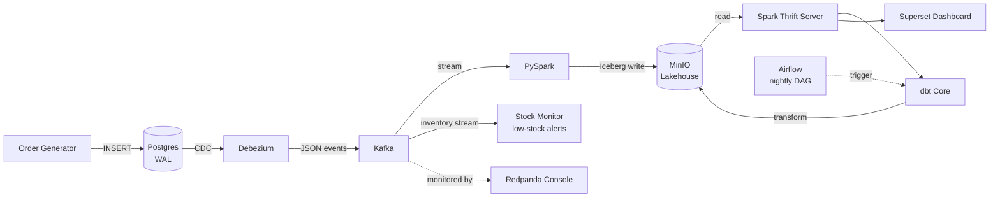
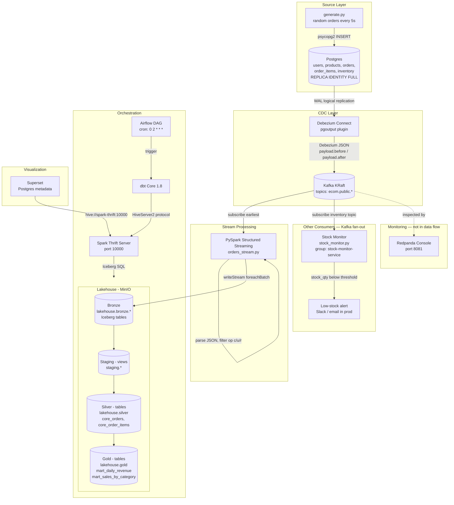

# E-Commerce Real-Time Pipeline

A real-time e-commerce data pipeline built with open-source tools on a self-hosted lakehouse. Designed as a portfolio project targeting Turkish e-commerce companies (Trendyol, n11, Hepsiburada).

## What This Project Solves

Modern e-commerce companies need to answer questions like *"How much revenue did we make today?"*, *"Which products are trending right now?"*, or *"How many orders got cancelled in the last hour?"* — and they need answers fast, without slowing down the production database.

This pipeline shows how to do that end-to-end:

- **Capture every change** in the operational database (Postgres) the moment it happens, without polling tables or impacting performance — using **CDC** via Debezium.
- **Decouple producers from consumers** with Kafka, so you can add new downstream systems (analytics, ML, search) without touching the source database.
- **Store raw data cheaply but reliably** in a self-hosted lakehouse (MinIO + Iceberg) — same benefits as Snowflake or Databricks, no cloud vendor lock-in.
- **Transform data in layers** (bronze → silver → gold) with dbt, so analysts get clean, business-ready tables and engineers keep raw data available for reprocessing.
- **Run transformations on a schedule** with Airflow, so the analytics tables are always fresh by morning.
- **Visualize results** with Superset, so business users see charts instead of SQL.

In short: it shows how to build the **same data infrastructure that companies like Trendyol, Hepsiburada or n11 run in production** — but with open-source tools and a single `docker compose up`.

## High-Level Architecture



## Low-Level Data Flow



## Component Breakdown

### Source Layer

**Order Generator (`generator/generate.py`)**
Python script using `psycopg2` to simulate real e-commerce traffic. Inserts random orders, users, products, and order items into Postgres every few seconds.
*Why:* You need a continuous source of data changes to demonstrate a real-time pipeline.

**Postgres 16 (`postgres/`)**
Operational database with WAL (Write-Ahead Log) enabled at the logical level. Every INSERT/UPDATE/DELETE is recorded in the WAL.
*Why:* Postgres is the only OLTP database in this pipeline. CDC works by reading the WAL, so it must be configured with `wal_level=logical` and `REPLICA IDENTITY FULL`.

### CDC Layer

**Debezium 2.6 (`debezium/`)**
Kafka Connect plugin that reads Postgres WAL via the `pgoutput` plugin and publishes change events to Kafka. Registered automatically at startup via `connector-init` service hitting the Debezium REST API.
*Why:* CDC enables capturing changes without polling tables. Zero load on the source database.

**Kafka (KRaft mode)**
Message broker that decouples the producer (Debezium) from consumers (PySpark, stock monitor). Topics: `ecom.public.orders`, `ecom.public.users`, `ecom.public.products`, `ecom.public.order_items`, `ecom.public.inventory`.
*Why:* Without Kafka, every downstream consumer would have to connect directly to Postgres. Kafka acts as a durable buffer with multiple consumer support.

**Redpanda Console**
Web UI for inspecting Kafka topics, messages, and connector status.
*Why:* Debugging streaming pipelines without a UI is painful. This is the "DevTools" of Kafka.

### Stream Processing

**PySpark 3.5.1 (`pyspark/orders_stream.py`)**
Structured Streaming job that:
1. Subscribes to all `ecom.public.*` topics from earliest offset
2. Parses the Debezium JSON payload
3. Filters to only `create`, `update`, `read` operations
4. Writes to Iceberg bronze tables in MinIO

*Why:* Kafka events are raw Debezium JSON. We need transformation logic and Iceberg format support — that's what Spark provides. A Kafka Connect S3 sink would only dump raw JSON.

**Stock Monitor (`stock-monitor/stock_monitor.py`)**
A second, independent Kafka consumer (consumer group `stock-monitor-service`) that subscribes to `ecom.public.inventory` and raises a low-stock alert when a product drops below a threshold. Does not touch the analytics pipeline.
*Why:* Demonstrates Kafka fan-out — the same CDC stream feeding multiple independent consumers. Adding it required no changes to Postgres, Debezium, Kafka, or PySpark. See "Multiple Consumers" below.

### Lakehouse

**MinIO**
S3-compatible object storage. Holds Iceberg table files (Parquet data + metadata JSON).
*Why:* Self-hosted alternative to AWS S3. The storage layer of the lakehouse.

**Apache Iceberg**
Open table format providing ACID transactions, schema evolution, time travel, and partition evolution on top of object storage.
*Why:* Without Iceberg, MinIO would just hold raw Parquet files with no transaction guarantees. Iceberg makes a data lake behave like a data warehouse.

**Iceberg Catalog — JDBC over Postgres (`iceberg-db`)**
The catalog tracks the current metadata pointer for every Iceberg table. This project uses a **JDBC catalog** backed by a dedicated Postgres instance instead of the simpler Hadoop catalog.
*Why:* The Hadoop catalog stores the metadata pointer as a file in object storage and commits by renaming it. On S3/MinIO, rename is **not atomic** and there is **no locking**, so two concurrent writers can clobber each other's commits — and here the streaming job writes bronze continuously while dbt writes silver/gold. A JDBC catalog turns each commit into an atomic Postgres transaction, which is the production-safe way to coordinate concurrent Iceberg writers without standing up a full Hive Metastore.

**Spark Thrift Server**
JDBC/ODBC endpoint exposing Spark SQL on port 10000.
*Why:* `spark-submit` runs batch jobs. Thrift Server keeps Spark running so dbt and Superset can connect and run SQL on demand via the HiveServer2 protocol.

**dbt Core 1.8 (`dbt/`)**
Transformation layer running SQL models in three layers:
- `staging` → views (staging)
- `core` → silver tables (lakehouse.silver)
- `mart` → gold tables (lakehouse.gold)

*Why:* Raw bronze data isn't analytics-ready. dbt provides modeling, testing, documentation, and lineage — the industry standard.

### Orchestration

**Apache Airflow 2.9 (`airflow/`)**
Runs `dbt_pipeline` DAG every night at 02:00. Two tasks: `dbt_run` → `dbt_test`.
*Why:* Streaming is continuous (PySpark) but transformations are batch. Airflow ensures dbt runs reliably on schedule with retries, logging, and observability.

### Visualization

**Apache Superset**
Connected to Spark Thrift via `hive://spark-thrift:10000`. Reads from `lakehouse.gold` tables.
*Why:* Closes the loop — business users see charts, not SQL. Metadata stored in a dedicated Postgres database (`superset-db`) for persistence across restarts.

## Data Layers

| Layer | Schema | Storage | Updated By |
|-------|--------|---------|------------|
| Bronze | `lakehouse.bronze` | Iceberg (MinIO, JDBC catalog) | PySpark streaming (continuous) |
| Staging | `staging` | Spark views (in-memory) | dbt (nightly) |
| Silver | `lakehouse.silver` | Iceberg (MinIO, JDBC catalog) | dbt (nightly) |
| Gold | `lakehouse.gold` | Iceberg (MinIO, JDBC catalog) | dbt (nightly) |

**Why layers at all?** Most source systems are **mutable** — an OLTP database
overwrites old values on every UPDATE. When an order moves from CREATED to
PAID, the CREATED state is gone forever in Postgres. CDC captures every change
before it disappears, but the captured events need to be organized. Raw events
go to bronze; cleaned, deduplicated rows go to silver; business-ready
aggregates go to gold. Each layer serves a different audience and a different
purpose.

**Bronze — raw, append-only, complete history.** Every CDC event lands here
exactly as Debezium emitted it: `op`, `lsn`, `ts_ms`, and the full
`payload.after`. The same `order_id` appears multiple times — once for
CREATED, once for PAID, maybe once for CANCELLED. Nothing is updated, nothing
is deleted. This is the source of truth for the entire pipeline; every
downstream layer can be rebuilt from bronze. It exists because the mutable
source database does not preserve history — bronze does.

*Without bronze, today nothing breaks* — silver and gold tables live in their
own Parquet files, reports keep working. But tomorrow the damage starts:

- *Nightly pipeline breaks.* `dbt run` fails because staging views read from
  `{{ source('bronze', 'orders') }}`. No bronze → no staging → no silver → no
  gold. Reports freeze at the last successful run.
- *Bug fixes become impossible.* You discover `paid_amount` has been
  miscalculated for 3 months. You fix the dbt model and run
  `dbt run --full-refresh` — but full refresh rebuilds silver from bronze. No
  bronze, no fix. You are stuck with 3 months of wrong revenue numbers.
- *New columns cannot be back-filled.* Business asks "show me cancellations by
  city." You need to join orders with user city — that enrichment comes from
  bronze `users` events. Without bronze you can only start from today; the last
  6 months of orders have no city.
- *New metrics cannot be computed retroactively.* "What was our average
  order-to-payment time last quarter?" requires both the CREATED and PAID
  events for the same order — bronze has both as separate rows. Silver only
  keeps the final state (PAID); the CREATED timestamp is there but the
  intermediate event history is lost. Gold has daily aggregates — individual
  order timing is gone entirely.
- *Audit and compliance gaps.* "Prove that order #12345 was CREATED before it
  was CANCELLED." Bronze has both events with WAL LSN timestamps. Silver has
  only the latest state. If a regulator or finance team asks for the sequence
  of state changes, only bronze can answer.

Bronze is cheap insurance — pennies per GB/month on object storage — against
all of the above. You rarely read old bronze data day-to-day, but when you
need it, nothing else can substitute.

**Staging — views that deduplicate.** Lightweight SQL views (not physical
tables) that read bronze, apply `ROW_NUMBER() OVER (PARTITION BY order_id
ORDER BY lsn DESC)`, and expose only the latest version of each row. They
vanish on Spark restart and are re-created by `dbt run` — by design, since
they cost nothing to rebuild.

**Silver — cleaned, enriched, business-entity tables.** Materialized Iceberg
tables that join staged data (orders + users, order\_items + products), apply
business rules (`WHERE status != 'CREATED'`), and add derived columns
(`paid_amount`, `is_cancelled`). One row per business entity. This is where
analysts start querying.

**Gold — aggregated, report-ready tables.** Pre-computed metrics:
`mart_daily_revenue` (daily totals), `mart_sales_by_category` (category
breakdown). Superset dashboards read from gold. These tables answer recurring
business questions without requiring analysts to write complex joins.

## Handling Updates: CDC Event Ordering

In a CDC pipeline a single row changes over time. An order moves
`CREATED → PAID` (or `CANCELLED`), so Debezium emits **several events for the
same `order_id`**. Bronze is append-only by design, so it stores every version
of the row — the silver layer is responsible for collapsing them down to the
latest state. The hard part is deciding which version *is* the latest.

A naive approach orders by `created_at`:

```sql
ROW_NUMBER() OVER (PARTITION BY order_id ORDER BY created_at DESC)
```

This is **wrong** here. `created_at` is set once at INSERT (`DEFAULT now()`)
and is never touched on UPDATE — correct semantics for a *creation* timestamp.
So the `CREATED` and `PAID` rows of the same order carry an identical
`created_at`, the ordering becomes non-deterministic, and `ROW_NUMBER` can keep
the stale `CREATED` row. Downstream, `core_orders` filters out `CREATED`
orders — so those orders silently disappear and **revenue is undercounted**.

The fix is to order by the database's own source of truth for change order: the
Postgres **WAL LSN** (Log Sequence Number). Every committed change gets a
unique, monotonically increasing LSN, exposed by Debezium in
`payload.source.lsn`. The streaming job captures it (plus `source.ts_ms` as a
tiebreaker) into bronze, and staging dedups on it:

```sql
ROW_NUMBER() OVER (PARTITION BY order_id ORDER BY lsn DESC, ts_ms DESC)
```

| order_id | op | status  | lsn      | kept |
|----------|----|---------|----------|------|
| 5        | c  | CREATED | 24023000 |      |
| 5        | u  | PAID    | 24023128 | ✓    |

This is the canonical way to order CDC events. It keeps the source schema
untouched — no need to add an `updated_at` column to the OLTP database, which
you often cannot modify in production anyway.

### Streaming Referential Consistency

`orders` and `order_items` are written to bronze as **independent streams**
with separate microbatches and checkpoints. At any instant the tail of one
stream can lead the other, so the newest order lines may briefly reference an
order that has not landed yet. This is normal eventual consistency, not a bug —
so the `order_id` referential-integrity tests are configured to **warn** on the
expected tail lag (`warn_if: ">0"`) and only **fail** on structural breakage
(`error_if: ">500"`), instead of demanding perfect consistency on a moving
target.

## Multiple Consumers: The Stock Monitoring Service

The same CDC stream can feed more than one consumer. The analytics pipeline
(PySpark → bronze → dbt) is one consumer; the **stock monitoring service** is a
second, completely independent one. It reads the `ecom.public.inventory` topic —
which Debezium already produces — and raises a low-stock alert when a product
drops below a threshold.

**Stock control is the application's job, not CDC's.** When a customer places an
order, the backend (OLTP) checks stock, decrements it, and rejects the order if
inventory is insufficient — all inside a single transaction, in milliseconds.
By the time Debezium sees the `stock_qty: 50 → 47` change in the WAL, the
decision is already made and the stock is already reduced. CDC **observes the
result**; it does not make the decision.

So what is inventory data good for on the CDC side?

- **Alerting / monitoring** — not stock *management*, stock *observation*. Notify
  the purchasing team when a product is running low so they can reorder from the
  supplier. The application won't do this — its job is taking orders, not supply
  planning.
- **Analytics** — burn-rate analysis: how fast does a product sell, at what
  hours does it accelerate, when will it run out? This history does not exist in
  OLTP (which only holds the *current* stock); it exists in the bronze event
  stream.
- **Synchronization** — push inventory changes to other systems: marketplace
  integrations (selling on one platform should update stock on another),
  warehouse management, supplier portals. Rather than each system connecting to
  the OLTP database separately, they all read from the Kafka topic.

**What it demonstrates architecturally.** Adding this service required **zero
changes** to Postgres, Debezium, Kafka, or PySpark. The `inventory` table was
already in Debezium's `table.include.list` with `REPLICA IDENTITY FULL`, so the
topic was already flowing — just unconsumed. The new service simply attaches a
**new consumer group** (`stock-monitor-service`) to that topic. Kafka gives each
consumer group an independent copy of the stream with its own offsets, so the
stock monitor reads at its own pace without affecting the analytics pipeline.
This is Kafka's fan-out capability in action — the concrete payoff of putting a
log between the source and its consumers.

The example implementation (`stock-monitor/stock_monitor.py`) logs alerts to
stdout; in production the alert path would call a Slack webhook, email, or
PagerDuty.

## Project Phases

- [x] Phase 1 — CDC Pipeline: Postgres + Debezium + Kafka + Order Generator
- [x] Phase 2 — Stream Processing: PySpark → MinIO (Iceberg)
- [x] Phase 3 — Lakehouse: dbt (staging → silver → gold)
- [x] Phase 4 — Orchestration: Airflow DAG (nightly dbt run)
- [x] Phase 5 — Dashboard: Superset
- [x] Phase 6 — Persistence: Kafka + Superset Postgres metadata
- [x] Phase 7 — Multiple Consumers: stock monitoring service (Kafka fan-out)

## Known Limitations & Production Roadmap

This is a portfolio project running on a single machine with Docker Compose.
The following items are **deliberate trade-offs** — documented here to show
awareness, not as oversights.

**Full refresh materialization.** Silver and gold tables are rebuilt from
scratch on every `dbt run`. The staging views scan the **entire** bronze layer
each time, so yesterday's data is reprocessed alongside today's. This is the
safest approach for correctness — every run produces a deterministic result
regardless of prior state — but it does not scale. At production volume
(millions of events/day), this should migrate to **dbt incremental
materialization**: `is_incremental()` filters bronze to only events newer than
the last run, and `MERGE INTO` upserts changed rows into the existing silver
table. The `unique_key` would be the business key (e.g. `order_id`), and the
`ts_ms` column already in bronze serves as the high-water mark.

## Data Retention & Storage Management

Data flows through several storage layers, each with its own retention
characteristics. No business data is ever lost — retention policies only
reclaim temporary or superseded storage, not source-of-truth records.

**Kafka (7-day replay window).** Topic retention defaults to
`retention.ms=604800000` (7 days). After 7 days, consumed messages are deleted
from the broker. This is safe because every event has already been written to
Iceberg bronze by PySpark. Kafka is a transit buffer, not long-term storage.
If PySpark needs to reprocess, it replays from Kafka within the 7-day window;
for anything older, bronze is the authoritative source.

**Iceberg snapshot expiration.** Every `dbt run` creates a new table snapshot —
a pointer to the set of Parquet files that represent the table at that moment.
Over time, snapshots accumulate. `expire_snapshots` removes old snapshots and
deletes Parquet files that are **no longer referenced by any remaining
snapshot**. Critically, the **current snapshot and its data are never touched**.
You lose the ability to time-travel to an expired point in time, but all
current rows remain intact. Think of it as clearing version history in a
document — the document itself stays, only the undo stack shrinks.

**Bronze is never deleted.** Bronze tables are append-only and live on cheap
object storage (MinIO / S3). They are the source of truth for the entire
pipeline. Silver and gold are derived — they can always be rebuilt from bronze
with `dbt run --full-refresh`. Deleting bronze would make reprocessing,
bug-fixing, and adding new columns to historical data impossible. The storage
cost of retaining bronze indefinitely (pennies per GB/month on S3) is
negligible compared to the cost of losing the ability to reprocess.

| Layer | What gets cleaned | What stays | Risk of deletion |
|-------|-------------------|------------|------------------|
| Kafka | Messages older than retention window | — | None — already in bronze |
| Iceberg snapshots | Old metadata + orphaned Parquet files | Current table state | Lose time travel only |
| Bronze | **Never** | All CDC events, all time | — |
| Silver / Gold | Rebuilt on every `dbt run` | Current transformed state | Rebuilt from bronze |

## Getting Started

### Prerequisites

- Docker + Docker Compose
- 16GB+ RAM recommended

### Run

```bash
git clone https://github.com/airdeniz/ecommerce-realtime-pipeline.git
cd ecommerce-realtime-pipeline
cp .env.example .env
docker compose up -d
```

### Initialize Superset (first run only)

```bash
docker exec ecom-superset superset db upgrade
docker exec ecom-superset superset init
docker exec ecom-superset superset fab create-admin \
  --username admin --firstname Admin --lastname User \
  --email admin@example.com --password admin
```

Then connect Superset to Spark Thrift Server:
- Settings → Database Connections → + Database → Apache Hive
- SQLAlchemy URI: `hive://spark-thrift:10000`

## Services

| Service | URL | Credentials | Volume |
|---------|-----|-------------|--------|
| Redpanda Console | http://localhost:8081 | — | — |
| Airflow | http://localhost:8082 | admin / admin | `airflow_db_data` |
| Debezium REST API | http://localhost:8083 | — | — |
| Superset | http://localhost:8088 | admin / admin | `superset_db_data` |
| MinIO Console | http://localhost:9001 | minioadmin / minioadmin123 | `minio_data` |
| Spark Thrift Server | localhost:10000 | — | — |
| Postgres | localhost:5433 | postgres / postgres | — |
| Iceberg Catalog DB | internal only | iceberg / iceberg | `iceberg_db_data` |
| Kafka | localhost:29092 | — | `kafka_data` |

> Debezium connector is registered automatically on startup via the `connector-init` service.
> `docker compose down` (without `-v`) preserves all data via named volumes.