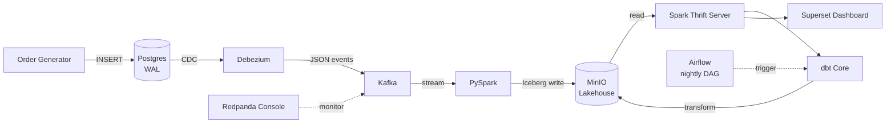
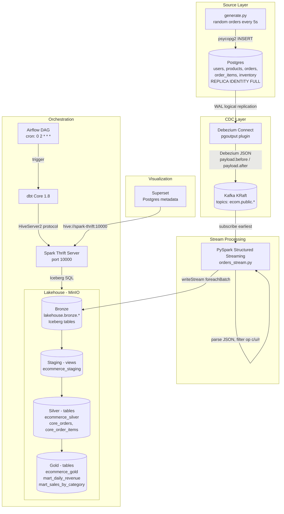

# E-Commerce Real-Time Pipeline

A real-time e-commerce data pipeline built with open-source tools on a self-hosted lakehouse. Designed as a portfolio project targeting Turkish e-commerce companies (Trendyol, n11, Hepsiburada).

## High-Level Architecture



## Low-Level Data Flow



## Component Breakdown

### Source Layer

**Order Generator (`generator/generate.py`)**
Python script using `psycopg2` to simulate real e-commerce traffic. Inserts random orders, users, products, and order items into Postgres every few seconds.
*Why:* You need a continuous source of data changes to demonstrate a real-time pipeline.

**Postgres 16 (`postgres/`)**
Operational database with WAL (Write-Ahead Log) enabled at the logical level. Every INSERT/UPDATE/DELETE is recorded in the WAL.
*Why:* Postgres is the only OLTP database in this pipeline. CDC works by reading the WAL, so it must be configured with `wal_level=logical` and `REPLICA IDENTITY FULL`.

### CDC Layer

**Debezium 2.6 (`debezium/`)**
Kafka Connect plugin that reads Postgres WAL via the `pgoutput` plugin and publishes change events to Kafka. Registered automatically at startup via `connector-init` service hitting the Debezium REST API.
*Why:* CDC enables capturing changes without polling tables. Zero load on the source database.

**Kafka (KRaft mode)**
Message broker that decouples the producer (Debezium) from consumers (PySpark). Topics: `ecom.public.orders`, `ecom.public.users`, `ecom.public.products`, `ecom.public.order_items`.
*Why:* Without Kafka, every downstream consumer would have to connect directly to Postgres. Kafka acts as a durable buffer with multiple consumer support.

**Redpanda Console**
Web UI for inspecting Kafka topics, messages, and connector status.
*Why:* Debugging streaming pipelines without a UI is painful. This is the "DevTools" of Kafka.

### Stream Processing

**PySpark 3.5.1 (`pyspark/orders_stream.py`)**
Structured Streaming job that:
1. Subscribes to all `ecom.public.*` topics from earliest offset
2. Parses the Debezium JSON payload
3. Filters to only `create`, `update`, `read` operations
4. Writes to Iceberg bronze tables in MinIO

*Why:* Kafka events are raw Debezium JSON. We need transformation logic and Iceberg format support — that's what Spark provides. A Kafka Connect S3 sink would only dump raw JSON.

### Lakehouse

**MinIO**
S3-compatible object storage. Holds Iceberg table files (Parquet data + metadata JSON).
*Why:* Self-hosted alternative to AWS S3. The storage layer of the lakehouse.

**Apache Iceberg**
Open table format providing ACID transactions, schema evolution, time travel, and partition evolution on top of object storage.
*Why:* Without Iceberg, MinIO would just hold raw Parquet files with no transaction guarantees. Iceberg makes a data lake behave like a data warehouse.

**Spark Thrift Server**
JDBC/ODBC endpoint exposing Spark SQL on port 10000.
*Why:* `spark-submit` runs batch jobs. Thrift Server keeps Spark running so dbt and Superset can connect and run SQL on demand via the HiveServer2 protocol.

**dbt Core 1.8 (`dbt/`)**
Transformation layer running SQL models in three layers:
- `staging` → views (ecommerce_staging)
- `core` → silver tables (ecommerce_silver)
- `mart` → gold tables (ecommerce_gold)

*Why:* Raw bronze data isn't analytics-ready. dbt provides modeling, testing, documentation, and lineage — the industry standard.

### Orchestration

**Apache Airflow 2.9 (`airflow/`)**
Runs `dbt_pipeline` DAG every night at 02:00. Two tasks: `dbt_run` → `dbt_test`.
*Why:* Streaming is continuous (PySpark) but transformations are batch. Airflow ensures dbt runs reliably on schedule with retries, logging, and observability.

### Visualization

**Apache Superset**
Connected to Spark Thrift via `hive://spark-thrift:10000`. Reads from `ecommerce_gold` tables.
*Why:* Closes the loop — business users see charts, not SQL. Metadata stored in a dedicated Postgres database (`superset-db`) for persistence across restarts.

## Data Layers

| Layer | Schema | Storage | Updated By |
|-------|--------|---------|------------|
| Bronze | `lakehouse.bronze` | Iceberg (MinIO) | PySpark streaming (continuous) |
| Staging | `ecommerce_staging` | Iceberg views | dbt (nightly) |
| Silver | `ecommerce_silver` | Iceberg tables | dbt (nightly) |
| Gold | `ecommerce_gold` | Iceberg tables | dbt (nightly) |

## Project Phases

- [x] Phase 1 — CDC Pipeline: Postgres + Debezium + Kafka + Order Generator
- [x] Phase 2 — Stream Processing: PySpark → MinIO (Iceberg)
- [x] Phase 3 — Lakehouse: dbt (staging → silver → gold)
- [x] Phase 4 — Orchestration: Airflow DAG (nightly dbt run)
- [x] Phase 5 — Dashboard: Superset
- [x] Phase 6 — Persistence: Kafka + Superset Postgres metadata

## Getting Started

### Prerequisites

- Docker + Docker Compose
- 16GB+ RAM recommended

### Run

```bash
git clone https://github.com/airdeniz/ecommerce-realtime-pipeline.git
cd ecommerce-realtime-pipeline
cp .env.example .env
docker compose up -d
```

### Initialize Superset (first run only)

```bash
docker exec ecom-superset superset db upgrade
docker exec ecom-superset superset init
docker exec ecom-superset superset fab create-admin \
  --username admin --firstname Admin --lastname User \
  --email admin@example.com --password admin
```

Then connect Superset to Spark Thrift Server:
- Settings → Database Connections → + Database → Apache Hive
- SQLAlchemy URI: `hive://spark-thrift:10000`

## Services

| Service | URL | Credentials | Volume |
|---------|-----|-------------|--------|
| Redpanda Console | http://localhost:8081 | — | — |
| Airflow | http://localhost:8082 | admin / admin | `airflow_db_data` |
| Debezium REST API | http://localhost:8083 | — | — |
| Superset | http://localhost:8088 | admin / admin | `superset_db_data` |
| MinIO Console | http://localhost:9001 | minioadmin / minioadmin123 | `minio_data` |
| Spark Thrift Server | localhost:10000 | — | — |
| Postgres | localhost:5433 | postgres / postgres | — |
| Kafka | localhost:29092 | — | `kafka_data` |

> Debezium connector is registered automatically on startup via the `connector-init` service.
> `docker compose down` (without `-v`) preserves all data via named volumes.
